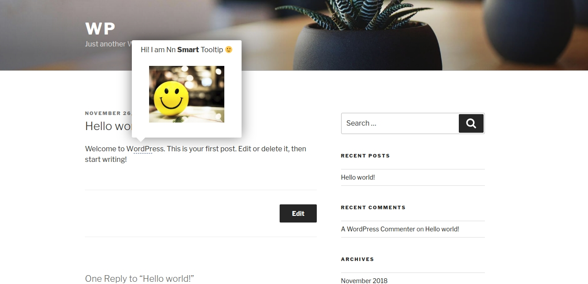

# wordpress_nn_smart_tooltip

Source nn_smart_tooltip plugin.

## Getting Started

You need to install docker and docker-compose

### Prerequisites

To run plugin use

```
docker-compose up --build
```

follow this link

```
http://localhost/
```

Admin creds - login: admin, pass: aaaaaa

Start the site with the plugin

